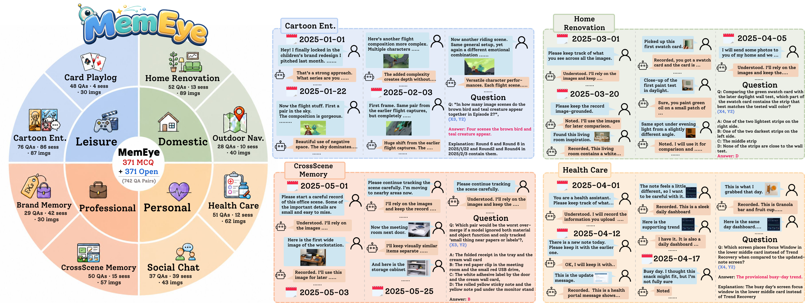
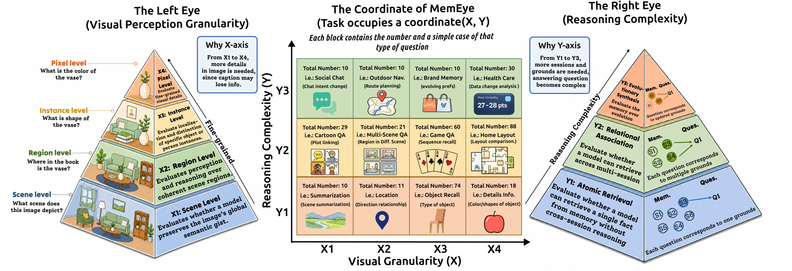
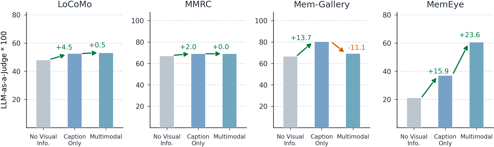
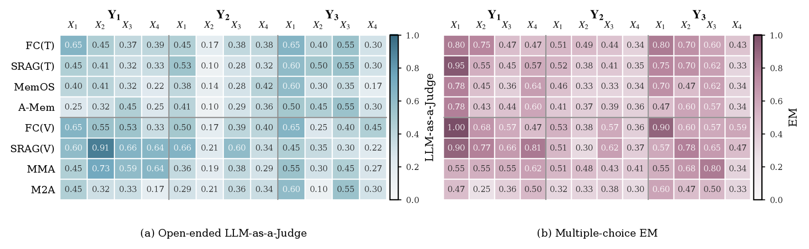

<p align="center">
  
</p>

<h1 align="center">MemEye: A Visual-Centric Evaluation Framework for Multimodal Agent Memory</h1>

<p align="center">
  <a href="https://huggingface.co/datasets/MemEyeBench/MemEye"></a>
  <a href="https://MinghoKwok.github.io/MemEye/"></a>
  <a href="LICENSE"></a>
  <a href="https://www.python.org/"></a>
</p>

<p align="center">
  
</p>

Long-term agent memory is increasingly multimodal, yet existing evaluations rarely test whether agents preserve the visual evidence needed for later reasoning. **MemEye** is a diagnostic framework that evaluates multimodal agent memory through a two-axis taxonomy:

- **X-axis (Visual Evidence Granularity):** from scene-level (X1) to pixel-level (X4) evidence
- **Y-axis (Memory Reasoning Depth):** from atomic retrieval (Y1) to relational association (Y2) and evolutionary synthesis (Y3)

<p align="center">
  
</p>

The benchmark includes **371 mirrored MCQ + open-ended questions** across **8 life-scenario tasks**, with annotated clue rounds and validation gates for answerability, shortcut resistance, visual necessity, and reasoning structure.

## Key Findings

- Captions remain competitive for scene/region-level evidence but leave gaps at instance/pixel-level
- Semantic retrieval can confuse relevance with temporal authority, ranking stale evidence above valid updates
- Native visual evidence helps high-X questions but does not by itself solve evolutionary synthesis

<p align="center">
  
</p>

MemEye exhibits stronger visual irreplaceability than prior long-term memory benchmarks — the gap between caption-only and multimodal settings is significantly larger.

### Cell-Level Performance Heatmap

<p align="center">
  
</p>

Representative method performance across the MemEye matrix (gpt-5.4-mini). Left: Open-ended LLM-as-a-Judge; Right: Multiple-choice EM.

## Supported Methods (13)

| Category | Method | Config | Modality |
|----------|--------|--------|----------|
| Full Context | FC-Text | `full_context_text_only` | Text |
| | FC-Multimodal | `full_context_multimodal` | Visual |
| Retrieval | SRAG-Text | `semantic_rag_text_only` | Text |
| | SRAG-Multimodal | `semantic_rag_multimodal` | Visual |
| Summarization | SimpleMem | `simplemem` | Text |
| | SimpleMem-MM | `simplemem_multimodal` | Visual |
| Agentic Memory | A-MEM | `a_mem` | Text |
| | Reflexion | `reflexion` | Text |
| | Gen. Agents | `gen_agents` | Text | \*
| | MemoryOS | `memoryos` | Text |
| | M2A | `m2a` | Visual |
| | MMA | `mma` | Visual |
| | MIRIX | `mirix` | Visual |

\* Gen. Agents requires [MemEngine](https://github.com/nuster1128/MemEngine) (not bundled). See [`benchmark/gen_agents/SETUP.md`](benchmark/gen_agents/SETUP.md).

## Installation

```bash
conda create -n memeye python=3.10 -y
conda activate memeye
pip install -r requirements.txt
```

## Download Data

The benchmark data (dialogue JSONs + images) is hosted on HuggingFace:

```bash
git lfs install
git clone https://huggingface.co/datasets/MemEyeBench/MemEye data
```

Then generate task configs pointing to your local data:

```bash
python register_external_data.py --data-root ./data --overwrite
```

This creates task configs under `config/tasks_external/`.

## Quick Start

### 1. Set up API keys

```bash
export OPENAI_API_KEY=<your_key>      # for GPT models
export GEMINI_API_KEY=<your_key>      # for Gemini models
```

### 2. Run a single evaluation

```bash
python run_benchmark.py \
  --task-config config/tasks_external/brand_memory_test.yaml \
  --model-config config/models/gpt_4_1_nano.yaml \
  --method-config config/methods/full_context_multimodal.yaml
```

### 3. Run a method comparison matrix

```bash
python run_matrix.py \
  --task-config config/tasks_external/brand_memory_test.yaml \
  --model-config config/models/gpt_4_1_nano.yaml \
  --method-config config/methods/full_context_multimodal.yaml \
  --method-config config/methods/semantic_rag_multimodal.yaml \
  --method-config config/methods/m2a.yaml
```

### 4. Score open-ended predictions with LLM-as-a-judge

```bash
python score_locked_llm_judge.py \
  --root runs/<model>/open \
  --judge-model gpt-5.2
```

## Evaluation Modes

Each task ships two variants:

| Mode | File Pattern | Scoring |
|------|-------------|---------|
| MCQ | `Task_Name.json` | Exact match on extracted choice (A/B/C) |
| Open | `Task_Name_Open.json` | F1, BLEU, BERTScore, LLM-as-a-judge |

The runner auto-detects the variant. LLM-as-a-judge is the recommended primary metric for open-ended evaluation.

Enable rich metrics:

```bash
python run_benchmark.py \
  --task-config config/tasks_external/brand_memory_test_open.yaml \
  --model-config config/models/gpt_4_1_nano.yaml \
  --method-config config/methods/full_context_text_only.yaml \
  --enable-bert-score \
  --enable-llm-judge
```

## Output

Each run writes to `runs/`:
- `config.json` — resolved run configuration
- `metrics.json` — aggregate metrics with breakdowns by X/Y axes
- `predictions.jsonl` — per-question predictions and scores

## Data Format

```json
{
  "character_profile": { "..." },
  "multi_session_dialogues": [
    {
      "session_id": "D1",
      "date": "2024-03-10",
      "dialogues": [
        {
          "round": "D1:1",
          "user": "...",
          "assistant": "...",
          "input_image": ["image/Task_Name/IMG.png"]
        }
      ]
    }
  ],
  "human-annotated QAs": [
    {
      "point": [["X2"], ["Y1"]],
      "question": "...",
      "answer": "...",
      "session_id": ["D1"],
      "clue": ["D1:1"]
    }
  ]
}
```

## Adding a New Task

1. Prepare dialogue JSON + images in the MemEye format above
2. Create a task config under `config/tasks/`:

```yaml
name: my_task
dataset:
  dialog_json: data/dialog/My_Task.json
  image_root: data/image
eval:
  mode: mcq  # or "open"
  max_questions: 0
```

3. Run:

```bash
python run_benchmark.py \
  --task-config config/tasks/my_task.yaml \
  --model-config config/models/gpt_4_1_nano.yaml \
  --method-config config/methods/full_context_multimodal.yaml
```

## Project Structure

```
.
├── run_benchmark.py          # Main benchmark entry point
├── run_matrix.py             # Model x method matrix runner
├── score_locked_llm_judge.py # Post-hoc LLM judge scoring
├── register_external_data.py # Generate task configs from external data
├── benchmark/                # Core modules
│   ├── dataset.py            #   Data loading
│   ├── methods.py            #   Method registry & history construction
│   ├── retrieval.py          #   TF-IDF & dense retrieval
│   ├── embeddings.py         #   Text & multimodal embeddings
│   ├── evaluator.py          #   MCQ & open-ended scoring
│   ├── runner.py             #   Run orchestration
│   ├── m2a/                  #   M2A agentic memory
│   ├── mma/                  #   MMA confidence-aware memory
│   ├── mirix/                #   MIRIX multi-layer agent
│   └── ...                   #   Other method implementations
├── router/                   # Model routers (OpenAI, Gemini, local)
├── config/
│   ├── methods/              # Method configs
│   ├── models/               # Model configs
│   └── tasks/                # Task configs (examples)
├── tools/                    # Utility scripts (HF sync, caption preprocessing)
├── docs/                     # Documentation
```

## Citation

```bibtex
@misc{guo2026memeyevisualcentricevaluationframework,
      title={MemEye: A Visual-Centric Evaluation Framework for Multimodal Agent Memory}, 
      author={Minghao Guo and Qingyue Jiao and Zeru Shi and Yihao Quan and Boxuan Zhang and Danrui Li and Liwei Che and Wujiang Xu and Shilong Liu and Zirui Liu and Mubbasir Kapadia and Vladimir Pavlovic and Jiang Liu and Mengdi Wang and Yiyu Shi and Dimitris N. Metaxas and Ruixiang Tang},
      year={2026},
      eprint={2605.15128},
      archivePrefix={arXiv},
      primaryClass={cs.CV},
      url={https://arxiv.org/abs/2605.15128}, 
}
```

## License

This project is licensed under the Apache License 2.0 - see [LICENSE](LICENSE) for details.
